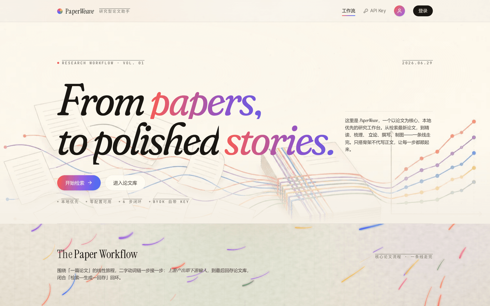
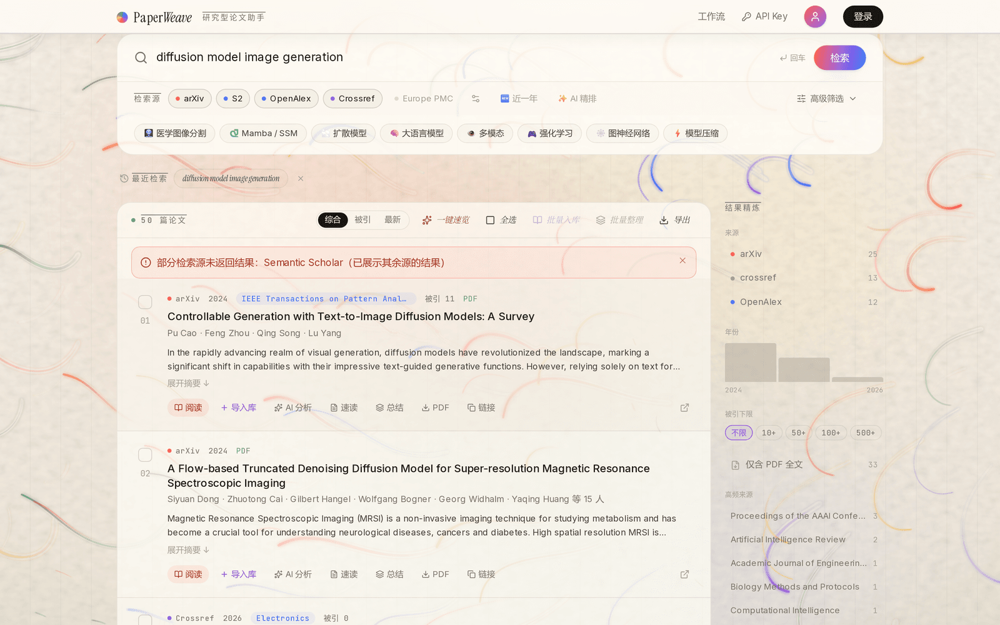
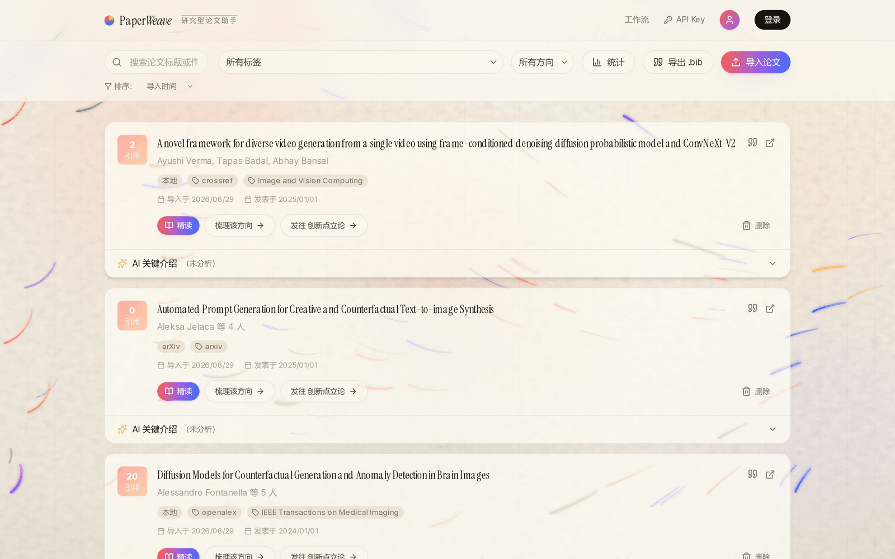
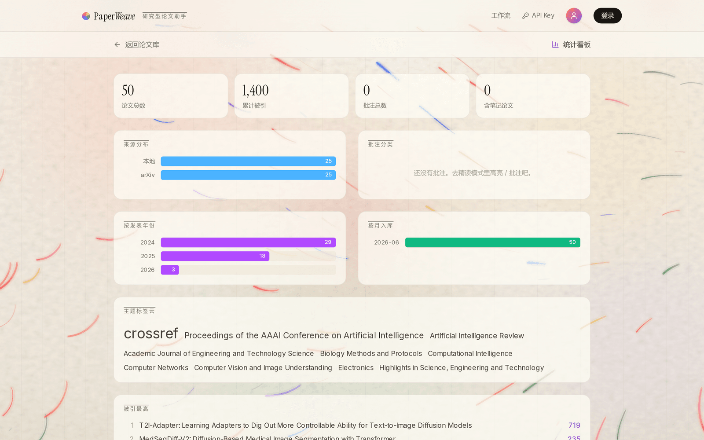

# PaperWeave

[中文](./README.md) · **English**

[](https://github.com/unumbrela/PaperWeave/actions/workflows/ci.yml)
[](./LICENSE)
[](https://nextjs.org/)
[](https://react.dev/)

**PaperWeave is a local-first workbench for reading papers and advancing research.** It does not write the paper for you. Instead, it brings every step around writing a paper — finding it, reading it, organizing your thoughts, drafting the structure, and producing figures — into a single workflow. All paper data lives in an in-browser paper library, which is the single source of truth.

```
Search → Read → Map → Theorize → Write → Illustrate
(检索 → 精读 → 梳理 → 立论 → 撰写 → 制图)
```

The main line has six steps, matching how a paper goes from a search to a finished draft: **Search** the latest literature → ingest and **Read** with annotations → **Map** the key points → **Theorize** on top of existing contributions → assemble materials and **Write** the structure → produce publication-grade **Illustrations**. The output of each step is the input of the next. The homepage lays out these six steps side by side; click any step to filter all workflow tools by that stage. Once a paper is in the library you can read, annotate, and ask questions inside it, and generate results from its contents (map / compare / theorize / write / illustrate). Generated results can be saved back to the matching paper entry in one click, closing the "search–read–generate–save-back" loop.



> The project also includes a separate **visualization gallery** (interactive teaching demos for CNN / Transformer / GAN / diffusion / medical segmentation, etc.) that runs real in-browser inference or playback, used to understand and explain models. The gallery is **independent of the workflow** — it does not enter the library and does not take part in one-click handoff.

> **This document is the repository's only documentation**: it introduces the features and onboarding for users, and gives a maintainer a map of the current code (architecture, conventions, invariants, known issues) plus an operations handbook (login cloud sync, deployment). Where the docs and the code disagree, the code wins.

---

## ✨ Feature Overview

### 🔎 Search

- **Literature search · multi-source aggregation** ([`/tools/paper-search`](app/tools/paper-search/page.tsx)): searches OpenAlex, arXiv, Crossref, and Europe PMC at the same time, using `Promise.allSettled` so one source failing does not drag down the overall result; supports field packs (CV / NLP / Mamba / diffusion…), must-include/exclude keywords, year and venue filters, a "🆕 last year" channel for new papers, and mid-search cancellation. Optional **query expansion** splits a research goal into several sub-queries, searches the sources concurrently, and re-ranks (auto-degrades to a single query when there is no LLM key). **One-click overview** packs the current results into one batched call and has the LLM generate a "one-line summary + positioning" per paper (saved as `summary` on ingest for downstream reuse); each result also supports **one-click read** — auto-ingest with dedup, then straight into the PDF reader.
- **Server-side search cache** (optional): with Supabase configured, hot queries hit a Postgres cache directly (14-day TTL) and the search page shows "🔥 Hot queries"; without it, it transparently degrades to direct upstream sources.
- **Citation network graph** ([`/tools/citation-graph`](app/tools/citation-graph/page.tsx)): pick any OpenAlex paper and its references and citing papers are drawn as a **D3 force-directed graph** — a bigger circle means more citations — with zoom, drag, and click-through.
- **Research lineage genealogy** ([`/tools/research-genealogy`](app/tools/research-genealogy/page.tsx)): the graph shows a single paper; the **genealogy shows a whole research direction**. The companion [`research-genealogy`](skills/research-genealogy/SKILL.md) skill runs multi-round search plus citation snowballing in the terminal and produces a "foundations → branching paths → parallel competition → frontier" genealogy (every builds-on relationship is verified against a real citation, not reported from model memory); the resulting `lineage.json`, pasted back into the site, renders as a clickable genealogy tree.

| Multi-source search | Citation network graph |
| --- | --- |
|  |  |

### 📖 Read · Paper Library (local-first)

- **Yours on ingest** ([`/library`](app/library/page.tsx)): metadata, abstracts, AI key points, research notes, and tags all live in the browser's IndexedDB (Dexie) — **no signup, works offline**.
- **PDF reader + four annotation types + page sticky notes** ([`/viewer/[id]`](app/viewer/[id]/page.tsx)): supports highlight, insight, todo, and transferable annotations; select text to have the AI explain it; reading progress is saved automatically; **📒 page sticky notes** let you drop a note anywhere on a page and write in it (paragraph gist, term definitions), drag to reposition, with a sidebar summary and jump-to-page, exported with the reading and in read-only shares; once a PDF is opened online it is silently cached as a local Blob, so afterwards **you can read it offline**.
- **Citation export**: one-click BibTeX + APA / MLA / GB/T 7714 per paper, one-click `.bib` for the whole library — all local pure functions, no API key needed.
- **Stats dashboard** ([`/library/stats`](app/library/stats/page.tsx)): shows source, year, monthly-ingest, and annotation-category distributions, plus a tag cloud and Top-5 cited — zero-config.

| Paper library | Stats dashboard |
| --- | --- |
|  |  |

### 🤖 Map · Theorize · Write · Illustrate (AI workflow)

- **Key-point mapping → innovation theorizing → structural writing → figure illustration**: paper Markdown → map the key points in a structured way → theorize a differentiated hypothesis on top of existing contributions (with a minimal verification experiment and a risk list) → assemble materials into a paper structure and paragraph scaffold ([`paper-writer`](app/tools/paper-writer/page.tsx), **only builds the skeleton and gives paragraph-level writing advice — it does not ghost-write coherent body text**) → generate **publication-grade plotting code** for methods and results (matplotlib / seaborn / plotly / TikZ, with colorblind-friendly palettes, journal single/double-column sizes, and a submission self-check list). The whole process is chained via **one-click handoff** with no copy-paste; the output can be **saved back** to a paper entry in one click, closing the workflow loop.
- **Literature comparison matrix** ([`/tools/paper-compare`](app/tools/paper-compare/page.tsx)): pick 2–6 papers from the library and the AI generates a "research question / method / dataset / metric / contribution / limitation" comparison matrix, exportable to Markdown.
- **Library Q&A (RAG)** ([`/tools/library-qa`](app/tools/library-qa/page.tsx)): builds an embedding semantic index over ingested papers (vectors cached locally, so repeated questions are not re-billed); a natural-language question runs cosine retrieval for the top-k, then the LLM synthesizes an answer **with [n] citations traceable to specific papers**, streamed token by token; with no embedding key it **auto-degrades to local BM25 keyword retrieval** (zero cost), so it works even with only DeepSeek configured.
- **Web article overview / document format conversion**: a URL or an uploaded Word / PDF / HTML file becomes clean Markdown with LaTeX formulas and tables (the OMML→LaTeX conversion is home-grown).


### 🧠 Visualization Gallery (interactive teaching demos, independent of the workflow)

> This group **does not belong to the main workflow above** — it does not enter the library or take part in one-click handoff. These are interactive demos for understanding a model and explaining a project, shown in a dedicated gallery section on the homepage.

- **CNN end-to-end walkthrough**: tiny-VGG runs **real inference in the browser** via TensorFlow.js, with feature maps viewable layer by layer. (The interaction and teaching path are **adapted from Georgia Tech's open-source "CNN Explainer" by Wang et al.**)
- **Medical image segmentation**: FWMamba-UNet's real intermediate-layer activations, offline-precomputed and replayed interactively. (Based on the author's own FWMamba-UNet paper.)
- **Transformer / GAN / diffusion**: a self-built end-to-end next-token pipeline, latent-vector interaction, and step-by-step denoising visualization.

| Transformer walkthrough | Diffusion walkthrough |
| --- | --- |
|  |  |

### 🔗 Sharing & Collaboration

- **Read-only sharing** (optional): a single paper (with annotations and notes) or the whole library becomes a public read-only link `/share/[token]` in one click. The content is a JSON snapshot taken at the moment of the click, independent of later local edits, valid for 30 days.

### 🧰 Out of the browser: Claude Code Skills

- Four core capabilities are packaged as installable [Claude Code skills](./skills/README.md): **`paper-search`** (key-free OpenAlex / arXiv search in the terminal), **`research-genealogy`** (research-direction genealogy: a tree plus a narrative report, stdlib-only scripts, key-free), **`cite-paper`** (arXiv ID / DOI / title → real metadata → BibTeX + GB/T 7714), and **`paper-figure`** (publication-grade plotting spec + local run verification). Run `cp -r skills/* ~/.claude/skills/` to install them.
- "Upstream output is downstream input" extends beyond the site: the `lineage.json` produced by `research-genealogy` in the terminal renders into a genealogy tree once pasted back into the site.
- The in-site "skill maker" tool can keep generating your own SKILL.md files.

---

## 🏗️ Tech Stack & Architecture

| Layer | Choice |
| --- | --- |
| Framework | Next.js 16 (App Router) · React 19 · TypeScript 5 |
| Styling | Tailwind CSS v4 + a home-grown warm-paper design system |
| AI | default **DeepSeek → OpenAI → Gemini** three-tier auto-fallback (any one key unlocks all AI tools); plus a **ZenMux** gateway where one key unlocks higher-end models — routing Claude / GPT / Gemini / DeepSeek / Qwen etc. (pick one in `/settings`; the selected model becomes the primary provider and falls back to the default chain on failure); embedding goes through OpenAI / Gemini |
| Search | OpenAlex + arXiv + Crossref + Europe PMC aggregation (with timeouts and rate limiting, cross-source dedup) |
| Persistence | **local** Dexie / IndexedDB (single source of truth, including PDF Blob) + **optional cloud** Supabase (Auth + Postgres + row-level security RLS) cross-device sync |
| Visualization | D3.js · Three.js / React Three Fiber · TensorFlow.js |
| Testing | Vitest (~240 unit tests / 24 files) · Playwright (2 browser-level E2E) · GitHub Actions four gates (lint / tsc / test / build) |

Scale: ~30k lines of TS/TSX, a tool registry of **19 items**, **28** API routes.

### The workflow main line

The homepage lays out the six-step main line side by side; each step is labeled with its input and output, and adjacent steps connect end to end.


### Data Flow (the most important thing to understand)

```
UI / hooks ──calls only──> lib/db/repository.ts (repository) ──reads/writes──> Dexie/IndexedDB (single source of truth)
                              │                                ├─ papers / annotations / notes / progress / embeddings
                              │                                └─ pdfBlobs (PDF binary in its own table, untouched by list queries)
                              └─(only when logged in AND Supabase configured) void cloudSync.push*() not awaited,
                                 fire-and-forget mirrored to Supabase Postgres (RLS isolated by user_id)
```

Rules that must be followed:

- **The UI never fetches paper data endpoints directly** — all paper/annotation/note/progress reads and writes go through [`lib/db/repository.ts`](lib/db/repository.ts).
- Cloud-sync failure never affects local; the switch is **login state** (`setCloudSyncUser`), and when logged out or unconfigured cloudSync is fully no-op; `test/repository.test.ts` guarantees zero network requests by default.
- The PDF Blob never goes to the cloud and lives in a separate `pdfBlobs` table; `stripLocal` strips local-only meta fields at the repository boundary.

### LLM Integration (two paths + BYOK)

| Path | Module | Notes |
| --- | --- | --- |
| Streaming | `streamChat()` in [`lib/ai/stream.ts`](lib/ai/stream.ts) | if the visitor selected a ZenMux model it is used first, otherwise DeepSeek → OpenAI → Gemini in sequence, switching automatically before the first token; a route-level guard returns a readable 503 when no key is configured, without breaking mid-stream; `idea-generator` can use a reasoner deep-reasoning tier |
| Non-streaming | [`lib/ai/client.ts`](lib/ai/client.ts) | same order (selected ZenMux model first → DeepSeek/OpenAI/Gemini), 30s timeout per provider, returns on first success |
| Model gateway | [`lib/ai/zenmux.ts`](lib/ai/zenmux.ts) · [`lib/ai/models.ts`](lib/ai/models.ts) | ZenMux is an OpenAI-compatible gateway (baseURL `https://zenmux.ai/api/v1`); the curated `ZENMUX_MODELS` list (`vendor/model` ids, all verified callable) is passed via the `x-zenmux-model` header; closed-source models route directly without extra opt-in |
| Embedding | [`lib/ai/embeddings.ts`](lib/ai/embeddings.ts) | OpenAI `text-embedding-3-small` (1536d) primary → Gemini `text-embedding-004` (768d) backup; the return value carries a `model` tag, and **vectors from different models must never be compared** |

**BYOK (bring your own key)**: `resolveKeys(req)` in [`lib/ai/keys.ts`](lib/ai/keys.ts) resolves keys in the order "request headers `x-deepseek-key`/`x-openai-key`/`x-gemini-key`/`x-zenmux-key` (plus `x-zenmux-model`) first → env vars as fallback"; the frontend counterpart is `lib/ai/user-keys.ts` and the `/settings` page. Placeholder keys (such as `ci-placeholder`) are treated as unconfigured. In a public deployment the server can carry no LLM key at all — zero cost to the host, and not abusable.

### Registry-driven

The single source of truth for all tools is [`lib/tools-registry.ts`](lib/tools-registry.ts) (the `TOOLS` array, **19 items**), split into four tiers via the `track` field:

- `workflow` (8): tools on the six-step main line that take part in the one-click handoff loop.
- `utility` (3): loosely-coupled peripheral tools (web overview / library Q&A / format conversion), pushed down to the Utilities section on the homepage, with empty phases.
- `gallery` (6): interactive teaching demos (model visualization), independent of the workflow.
- `lab` (2): command-line / automation extensions (task planner / automation packager), with empty phases.

Homepage filtering and search, and `app/sitemap.ts`, are all driven by it. Invariants are guarded by `test/tools-registry.test.ts`: unique slugs, a required `app/tools/<slug>/page.tsx`, valid phases, and each track fully partitioning TOOLS. **Adding a tool = one registry entry + one page**, nothing else changes.

### Tool-to-tool handoff

[`lib/workflow/handoff.ts`](lib/workflow/handoff.ts): upstream `stageHandoff(targetSlug, payload)` writes sessionStorage then navigates, and downstream `consumeHandoff(slug)` consumes it once on mount. The payload can carry `sourcePaperId`, and downstream output is saved back to that paper entry via the `SaveToLibrary` component, closing the "paper → generate → save-back" loop. The chain even leaves the browser: `skills/research-genealogy` produces `lineage.json` in the terminal → the `/tools/research-genealogy` page renders it into a genealogy tree (paste-import, no backend involved).

---

## 🔒 Conventions & Invariants (read before changing code)

1. **Zero-config build**: `pnpm build` must pass with no env at all — every external dependency must initialize lazily and degrade to null.
2. **Best-effort periphery**: the search cache, cloud sync, and log metrics swallow failures and never affect the main function's return.
3. **Pure functions first**: testable logic (graph building, citations, snapshots, RAG retrieval, cache keys, rate limiting, fan-out re-ranking) is all extracted into side-effect-free pure functions in `lib/`, with routes doing orchestration only — this is why the hundred-plus unit tests stay lightweight; please follow suit for new logic.
4. **Type source**: domain types are imported from [`lib/db/types.ts`](lib/db/types.ts), never re-declaring `Paper`/`Author` in pages.
5. **Public key-free routes must be rate-limited**: use `enforceRateLimit` ([`lib/api/http.ts`](lib/api/http.ts)), and upstream fetches must have timeouts; the PDF proxy has SSRF protection (domain allowlist).
6. **maxDuration ≤ 60**: the Vercel Hobby cap — new routes must not exceed it.
7. Chinese comments and a Chinese UI are the established style; commit messages use `type: Chinese description`.

---

## 🚀 Quick Start

```bash
# requires Node.js >= 20, package manager pnpm
pnpm install
pnpm dev          # http://localhost:3000
```

At this point **all core features already work**: search, ingest, PDF reading/annotation, citation export, and the stats dashboard need no configuration.

### Environment Variable Behavior Matrix (`.env.local`, all optional)

| Variable | When configured | When missing (must stay usable) |
| --- | --- | --- |
| `DEEPSEEK_API_KEY` | streaming AI available by default (idea generation can use reasoner deep reasoning) | readable 503 prompt, guiding visitors to bring their own key in `/settings` |
| `OPENAI_API_KEY` / `GOOGLE_API_KEY` | DeepSeek-equivalent fallback + embedding | same as above |
| `ZENMUX_API_KEY` | unlocks higher-end models (Claude / GPT / Gemini / DeepSeek / Qwen etc. via the ZenMux gateway, pick one in `/settings`) | does not affect the default chain; DeepSeek/OpenAI/Gemini work as usual |
| `NEXT_PUBLIC_SUPABASE_URL` + `NEXT_PUBLIC_SUPABASE_ANON_KEY` | shows the login entry; login enables two-way cloud sync | login entry hidden, pure local mode |
| `SUPABASE_SERVICE_ROLE_KEY` (+ `SUPABASE_URL`) | search cache, hot queries, read-only sharing | cache transparently degrades to direct; sharing entry hidden |
| `METRICS_TOKEN` | gates `/api/metrics` | the metrics endpoint is public |

> The real switch for cloud sync is **login state** (`setCloudSyncUser` in [`lib/sync/cloud-sync.ts`](lib/sync/cloud-sync.ts)); there is no separate toggle env var, and being logged out means zero network requests (covered by a unit test). **It builds and runs fully even with no env configured at all.**

### Testing & Checks

```bash
pnpm lint                 # ESLint (CI gate; vendored visualization code is in eslint.config.mjs ignores)
pnpm exec tsc --noEmit
pnpm test                 # Vitest unit tests (~240 / 24 files, runs in ~0.6s)
pnpm test:e2e             # Playwright E2E (2 tests, APIs injected with fixtures via page.route, no external network)
pnpm build                # next build --webpack; builds with no env configured
```

---

## 🔑 Login & Cloud Sync (optional · Supabase)

After login the library syncs across devices and browsers and survives cache clears. It uses **Supabase** (Auth + Postgres + row-level security RLS), fully managed, plugged into an existing deployment via env vars. The code is fully wired; below are the steps you need to perform **in the Supabase / Vercel consoles** (~15 minutes). **Until you do these, the site runs in "pure local mode" as usual and the login entry is hidden.**

1. **Create a Supabase project**: open https://supabase.com → New project (pick a nearby region, e.g. Singapore) → **Project Settings → API** and note the **Project URL** and **anon public** key.
2. **Create tables + enable RLS**: console **SQL Editor** → paste and run all of [`supabase/schema.sql`](./supabase/schema.sql). It creates 4 user tables (papers / annotations / research_notes / read_progress) and enables RLS — each user can only read and write their own data.
3. **Configure login providers** (**Authentication → Providers**):
   - **Email**: enabled by default.
   - **Google one-click login**: create an OAuth 2.0 Web client in Google Cloud Console, set the authorized redirect URI to `https://<your-project>.supabase.co/auth/v1/callback`, and put the Client ID / Secret back into Supabase's Google provider.
   - **Phone** (optional): requires a paid SMS provider (such as Twilio); without it, the phone option in the login box erroring is expected, and email / Google are unaffected.
4. **Redirect allowlist (the step most likely to break — broken confirmation emails are usually here)**: **Authentication → URL Configuration** → set **Site URL** to your production domain (e.g. `https://www.z1ha0.com`; if it is still `localhost:3000`, all confirmation emails redirect locally and won't open); add `https://<prod-domain>/**`, `http://localhost:3000/**`, and `https://*.vercel.app/**` to **Redirect URLs**. Redirects all land on `/auth/callback`.
5. **Set env vars in Vercel** (add to both Production and Preview), save and Redeploy once:
   ```
   NEXT_PUBLIC_SUPABASE_URL = https://<your-project>.supabase.co
   NEXT_PUBLIC_SUPABASE_ANON_KEY = <anon public key>
   ```
   > The anon key is protected by RLS, so it is fine on the frontend.
6. **(Optional) backend search cache + hot queries + read-only sharing**: `schema.sql` also creates two "site-wide shared, service-role only" tables `search_cache` / `shares`. To enable them, add one **server-only** variable:
   ```
   SUPABASE_SERVICE_ROLE_KEY = <service_role key>
   ```
   > ⚠️ The service-role key has full privileges — **never give it the `NEXT_PUBLIC_` prefix and never put it on the frontend**. Without it, search goes direct to upstream as usual and the hot-query and share entries auto-hide.

**How it works**: local is always the instant source of truth (writes hit Dexie first, zero-latency and offline-capable); after login each write is best-effort mirrored to Supabase (with `user_id`, RLS-isolated), and on login the locally-accumulated library is pushed up first, then the full cloud set is pulled and merged → switching devices or clearing cache and logging back in restores everything. **v1 limits**: the PDF file itself does not go to the cloud (only metadata syncs), so on a new device arXiv papers are auto-refetched via `/api/pdf-proxy` while locally-uploaded PDFs require the original device; conflict merge is "last writer wins" (by `updated_at`), suited to a single user across multiple devices.

---

## 🌐 Deployment (Vercel + Cloudflare)

Goal: deploy a public site that "anyone can use just by opening the link." Use **Vercel** (official Next.js, free Hobby is enough) for the platform, **Cloudflare** (at cost) for the domain, and **bring-your-own-key** for AI (zero public cost, not abusable). The code-level adaptation is done; below are the steps you need to perform **yourself** (account login / payment).

1. **Push to GitHub**: `git push` (the repo is already at `github.com/unumbrela/PaperWeave`).
2. **Deploy to Vercel** (~5 minutes): log in at vercel.com with GitHub → **Add New → Project** → select and Import the repo → Framework auto-detected as Next.js (defaults are fine) → **leave all env vars empty (recommended)** (BYOK: visitors bring their key in `/settings`; to make AI available by default at your own cost, add `DEEPSEEK_API_KEY` and set a budget cap in the dashboard) → **Deploy**. Every subsequent `git push` to main redeploys automatically.
3. **Buy a domain** (Cloudflare, ~$10/year): open dash.cloudflare.com → **Domain Registration → Register Domains** → search a name and pay.
4. **Attach the domain to Vercel** (~5 minutes): in Vercel **Settings → Domains**, enter the domain and Add → per the DNS records it gives (root `A → 76.76.21.21`, `www CNAME → cname.vercel-dns.com`, follow the actual page) add them in Cloudflare **DNS → Records** → **key step**: set both records' proxy status to **DNS only (grey cloud)**, otherwise the Cloudflare proxy and the Vercel certificate conflict → wait a few minutes, and Vercel issues HTTPS automatically.

**AI cost model**: the server carries no LLM key by default; the visitor's key lives only in their browser localStorage, is forwarded via request headers to the model vendor on each call, and our server never persists it — a public demo costs you nothing and can't be drained, while key-free features (search / reading / annotation / visualization) keep working.

**Honest pre-launch checklist**: ① Vercel Hobby = personal non-commercial use, 60s function timeout (all AI routes' `maxDuration` is capped at 60; occasional timeouts on long generation can be relaxed to 300s on Pro); ② third-party asset licensing — mind the licenses of bundled third-party assets before public release; ③ the app UI is Chinese-only with no i18n, raising the bar for overseas users — an English landing page can come first.

---

## 📂 Project Structure

```
app/                  # Next.js App Router
├── page.tsx          #   homepage: 6-step workflow corridor + tool grid (registry-driven) + gallery + Lab
├── library/          #   paper library (list / detail (the chain hub) / stats dashboard)
├── viewer/[id]/      #   PDF reader (react-pdf) + four annotation types
├── settings/         #   bring-your-own-key settings
├── share/[token]/    #   read-only share page
├── tools/<slug>/     #   tool pages (one-to-one with the registry: workflow / utility / gallery / lab)
├── opengraph-image.tsx, sitemap.ts, robots.ts
└── api/              #   28 route.ts files (search / AI / share / metrics…), all runtime=nodejs, maxDuration≤60
components/           # UI components (organized by tool domain); shared parts states / use-stream (stoppable) / tool-shell / workflow controls
lib/
├── tools-registry.ts #   ★ single source of truth for all tools (19 items, 4 tracks)
├── db/               #   ★ Dexie table defs / repository / shared domain types (types.ts)
├── ai/               #   ★ LLM integration (streaming stream.ts / non-streaming client.ts / BYOK keys.ts / embedding)
├── paper-search/     #   multi-source aggregation / cache / citation-graph building / query expansion / fan-out re-ranking (pure functions)
├── library-qa/       #   RAG retrieval (cosine top-k + BM25 fallback, pure functions)
├── genealogy/        #   research-direction genealogy: lineage.json parsing + DFS tree (pure functions)
├── workflow/         #   tool-to-tool one-click handoff
├── sync/ supabase/   #   optional cloud sync (fully no-op when unconfigured/logged out)
├── api/              #   in-memory sliding-window rate limiting / clientIp / fetch with timeout / structured logs + metrics
└── export/ share/    #   citation export / share snapshots (pure functions)
skills/               # installable Claude Code skills (paper-search / research-genealogy / cite-paper / paper-figure)
supabase/schema.sql   # cloud tables + RLS (4 user tables + search_cache + shares, run once in the console)
test/  e2e/           # Vitest unit tests (~240)  ·  Playwright (happy-path + ai-tools)
```

---

## 🛡️ Engineering & Reliability

- **Route hardening**: `zod` input validation on key routes; key-free public routes (search / citation graph / PDF proxy / share) rate-limited per IP with a sliding window; all upstream calls have timeouts; the PDF proxy has SSRF protection.
- **Streaming experience**: AI output streams token by token, supports mid-stream stop while keeping generated text; multiple providers switch automatically before the first token; with no key configured it returns a readable 503 instead of breaking mid-stream.
- **Observability**: structured JSON access logs + a [`/api/metrics`](app/api/metrics/route.ts) aggregate view (call volume / error rate / average latency / cache hit rate / per-LLM-provider share).
- **SEO**: registry-driven auto-generation of `sitemap.xml`, `robots.txt`, and dynamic OpenGraph cards.

### 🗒️ Known Issues / Notes

1. **In-memory rate limiting & metrics**: both the sliding-window limiter and `/api/metrics` are per-instance and do not aggregate across serverless instances (accepted by design; strong consistency would need Upstash/Sentry).
2. **Search cache / sharing need service-role**: these two features are invisible on deployments without `SUPABASE_SERVICE_ROLE_KEY` — confirm the environment before a demo.
3. **Chinese-only, no i18n** (app UI); vendored visualization code (some explainers / ganlab) is in eslint ignores, with historical lint debt uncleared.
4. **PDF Blob does not go to the cloud** (v1 design): after switching devices a PDF must be opened online once before offline reading.
5. Mind the licensing of bundled third-party assets on public release; the rest of the assets are original.

---

## 🤝 Contributing

The cost of adding a tool is small: add one entry to [`lib/tools-registry.ts`](lib/tools-registry.ts), write one `app/tools/<slug>/page.tsx`, and homepage display, stage filtering, search, and sitemap all take over automatically. The registry's invariants (unique slug, page file exists, valid track/phase) are guarded by unit tests. PRs following this pattern are welcome.

## 📄 License

[MIT](./LICENSE)
